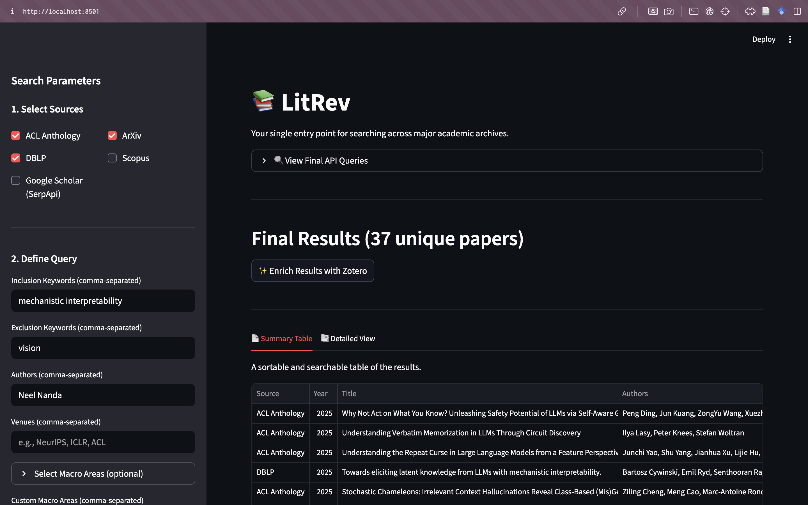

# 📚 LitRev

[![Python Version][python-badge]][python-link]
[![License: GNUv3][license-badge]][license-link]

LitRev is a unified search tool for conducting comprehensive academic literature reviews. It allows you to query multiple major archives simultaneously using a single, intuitive interface and a powerful "AND of ORs" query structure.

The application features both Streamlit and CLI interfaces.



---

## ✨ Key Features

-   **Unified Search**: Query multiple sources at once with a single command.
-   **Comprehensive Filtering**: Filter by inclusion/exclusion keywords, authors, venues, macro-areas, and year ranges.
-   **Smart Conflict Resolution**:
    -   Automatically resolve duplicate papers found in multiple sources based on a user-defined source priority.
    -   Provides a clean UI to manually resolve any remaining conflicts.
-   **Metadata Enrichment**: Integrates with a local Zotero Translation Server to enrich search results with clean, standardized metadata.
-   **ASReview Integration**: Export your final, curated dataset in a format perfectly compatible for import into [ASReview LAB](https://asreview.readthedocs.io/en/latest/index.html) for screening.

## 📡 Supported Archives

-   ACL Anthology
-   ArXiv
-   DBLP
-   Scopus
-   Google Scholar (via SerpApi for reliability)

---

## ⚙️ Full Workflow Overview

The entire workflow, from initial search to final screening, is designed to be seamless:

`Search in App` → `Auto-Resolve Duplicates` → `Manually Resolve Conflicts` → `Enrich with Zotero` → `Download for ASReview` → `Import into ASReview LAB`

---

## 🚀 Installation and Setup

Follow these steps carefully to get the application running.

### Step 1: Prerequisites

-   **Git**: To clone the repository.
-   **Python 3.10+**: Make sure Python is installed on your system. **Use a virtual environment and keep it active for the rest of the usage/installation!**
-   **Poetry**: For managing dependencies. If you don't have it, [install it from here](https://python-poetry.org/docs/#installation).
-   **Docker**: Required to run the Zotero Translation Server. [Install it from here](https://www.docker.com/products/docker-desktop/).

### Step 2: Clone and Install Dependencies

```bash
# Clone the repository
git clone https://github.com/your-username/lit-rev.git
cd lit-rev

# Install all required Python packages using Poetry
poetry install
```

### Step 3: Configure API Keys

For full functionality and reliability, API keys for Scopus and SerpApi are required. The application uses a `.env` file to manage these secrets.

1.  **Get Your Keys**:
    -   **Scopus**: Go to the [Elsevier Developer Portal](https://dev.elsevier.com/), create an account, and get an API key.
    -   **SerpApi**: Go to [SerpApi.com](https://serpapi.com/), sign up for an account (a free plan is available), and get your API key. This is used for reliable Google Scholar scraping.

2.  **Create and Edit the `.env` file**: Create and open the `.env` file and paste your keys into the appropriate fields.

    ```ini
    # .env
    SCOPUS_API_KEY="YOUR_SCOPUS_KEY_HERE"
    SERPAPI_API_KEY="YOUR_SERPAPI_KEY_HERE"
    ```
    > **Security Note**: The `.gitignore` file is already configured to ignore the `.env` file, ensuring your keys are never committed to version control.

### Step 4: Set Up and Run the Zotero Translation Server

The Zotero server is a powerful engine that extracts high-quality, standardized metadata from paper URLs. It runs locally in a Docker container.

1.  **Start Docker**: Make sure Docker is running on your machine.

2.  **Download and Run the Server**: In your terminal, run the following command. The first time you run this, it will download the necessary image, which may take a few minutes.
    ```bash
    docker run -d -p 1969:1969 --name zotero-translation-server zotero/translation-server
    ```
    This command starts the server in the background and keeps it running.

    -   To **stop** the server later: `docker stop zotero-translation-server`
    -   To **start** it again in the future: `docker start zotero-translation-server`

---

## 💻 Usage

### 🌐 Running the Streamlit Web App (Recommended)

This is the primary and most user-friendly way to use the tool.

1.  Make sure your Zotero Docker container is running (see Step 4 above).
2.  In your terminal, from the project's root directory, run:
    ```bash
    streamlit run app.py
    ```
Your browser will open with the application, ready for you to start searching.

### ⌨️ Using the Command-Line Interface (CLI)

The CLI is perfect for scripting or for users who prefer the terminal.

#### Interactive Wizard

For a guided experience that prompts you for each parameter:
```bash
python run lit-rev interactive
```

#### Direct Search with Flags

Use the `search` command for precise, one-off searches.

-   **Simple Search**:
    ```bash
    python lit-rev search -i "large language model" -s ArXiv
    ```

-   **Complex Search with Auto-Resolution**:
    ```bash
    python lit-rev search \
      -i "mechanistic interpretability" \
      -a "Neel Nanda" \
      -v "NeurIPS" \
      -m "Computer Science" \
      --start-year 2022 \
      --preferred-source "ArXiv" \
      --preferred-source "DBLP"
    ```

---

## 📈 The ASReview Workflow

This tool is designed to produce a clean, ready-to-screen dataset for ASReview LAB.

1.  **Perform Your Search**: Use the Streamlit app to run your query and get an initial set of results.
2.  **Resolve Duplicates**: Use the automatic source preference and the manual conflict resolution UI to curate a final, unique list of papers.
3.  **Enrich with Zotero**: Click the "Enrich Results with Zotero" button to fetch high-quality metadata. This is highly recommended for a better screening experience.
4.  **Download for ASReview**: In the "Summary Table" tab, click the **"Download for ASReview (CSV)"** button. This saves a specially formatted CSV file that includes the crucial `included` column required by ASReview.
5.  **Start ASReview LAB**:
    ```bash
    python -m asreview lab
    ```
6.  **Import Your Data**: In the ASReview web interface, create a new project. When prompted to "Select a Dataset," upload the CSV file you downloaded from LitRev Engine. You can then begin your screening process.

---


## 📄 License

This project is licensed under the GNU GPLv3 License. See the [LICENSE](LICENSE) file for details.

[python-badge]: https://img.shields.io/badge/Python-3.10%2B-blue.svg
[python-link]: https://www.python.org/downloads/
[license-badge]: https://img.shields.io/badge/GNU-v3
[license-link]: https://opensource.org/licenses/gpl-3-0